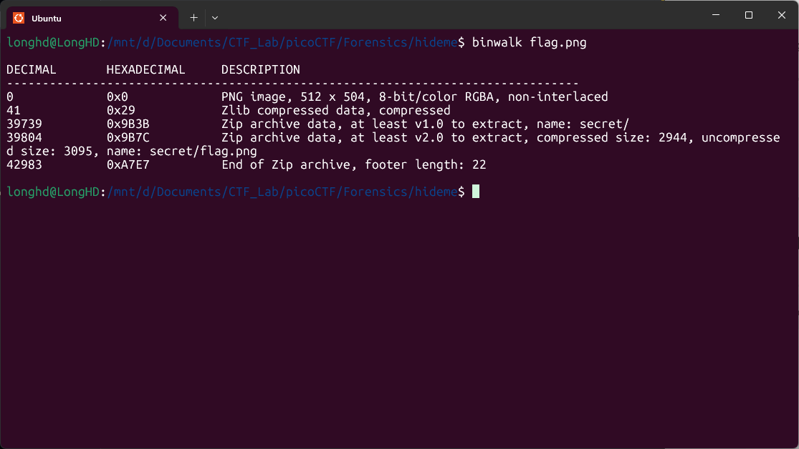

# Write-Up: hideme - picoCTF

**Thể loại:** Forensics  
**Mức độ:** Vừa 
**Tác giả:** Hà Duy Long - AT02 - PTIT

---

# Mô tả

Phân tích ảnh png

---

# Các bước thực hiện

1. **Kiểm tra xem có gì ẩn giấu trong ảnh không**

   ```bash
   binwalk flag.png
   ```

   

    Xử dụng lệnh `binwalk -e` để lấy ra những file ẩn giấu đấy

    ```bash
    binwalk -e flag.png
    ```

2. **Flag**
   picoCTF{Hiddinng_An_imag3_within_@n_ima9e_ad9f6587}