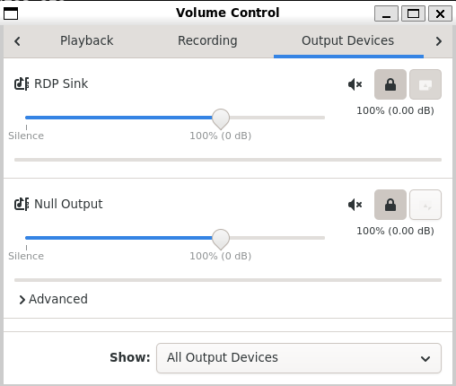
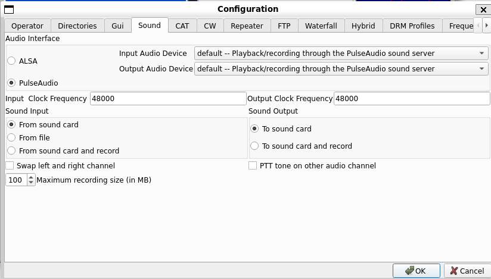
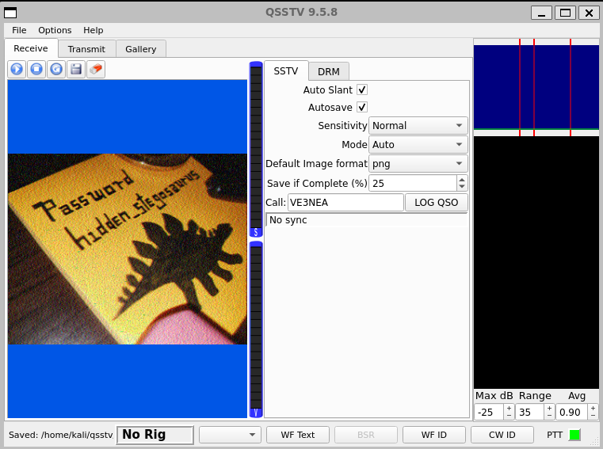
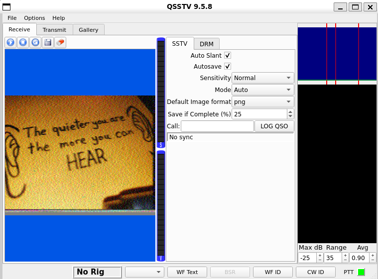
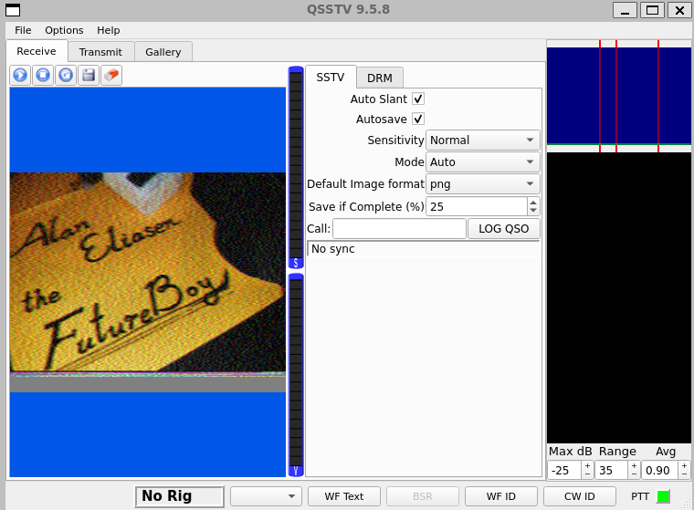
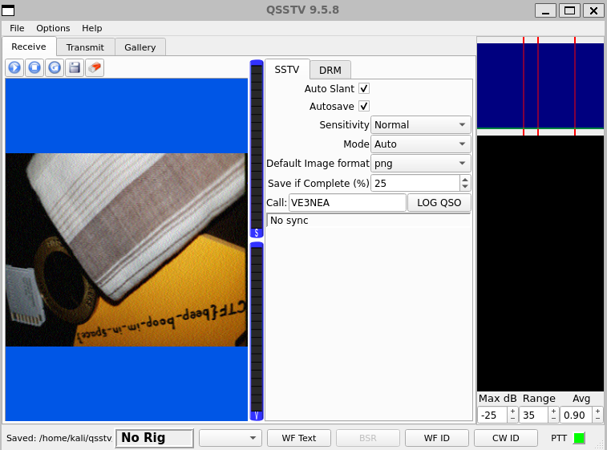

# Write Up

## Set up 

```bash
pactl load-module module-null-sink sink_name=virtual-cable
```

Mở `pavucontrol`

```bash
pavucontrol
```

Đảm bảo trong `Output Devices` có `Null Output`



Mở `qsstv`

```bash
qsstv
```

Chọn `Options` -> `Configuration` -> `Sound` -> `Pulse Audio`



Quay lại `pavucontrol`, đảm bảo trong `Recording` QSSTV thu từ `Null Output`


---

## Chạy từng file

Đầu tiên sẽ là `clue1.wav`

```bash
$ paplay -d virtual-cable clue1.wav
```



Thông điệp: `Password hidden_stegosaurus`

Tiếp theo là `clue2.wav`

```bash
$ paplay -d virtual-cable clue2.wav
```



Thông điệp: `The quieter you are the more you can HEAR`

Tiếp theo là `clue3.wav`

```bash
$ paplay -d virtual-cable clue3.wav
```



Thông điệp: `Alan Eliasen the FutureBoy`

Cuối cùng là `message.wav`

```bash
$ paplay -d virtual-cable message.wav
```



Thông điệp: `CTF{beep_boop_im_in_space}`

Đây là flag của `m00nwalk` nên chắc không phải flag của cái này đâu

Dựa trên các clue trước ta có thể có những thông tin sau:
- `Password hidden_stegosaurus`: Có thể đây là mật khẩu giải mã
- `The quieter you are the more you can HEAR`: Gợi ý rằng file âm thanh có dữ liệu ẩn siêu nhỏ (low-volume) hoặc LSB steganography trong file WAV
- `Alan Eliasen the FutureBoy`: Đây là tác giả của chương trình `Cochran`, một phần mềm liên quan đến SSTV/AMTOR/etc. Không nhất thiết là công cụ, nhưng có thể là hint về việc xử lý tín hiệu sâu

Vậy chúng ta sẽ thử dùng `steghide` để kiểm tra xem có ẩn file nào trong `message.wav` không

```bash
$ steghide extract -sf message.wav
Enter passphrase:
wrote extracted data to "steganopayload12154.txt".
```

---

## Flag

```bash
$ cat steganopayload12154.txt
picoCTF{the_answer_lies_hidden_in_plain_sight}
```

Flag: picoCTF{the_answer_lies_hidden_in_plain_sight}