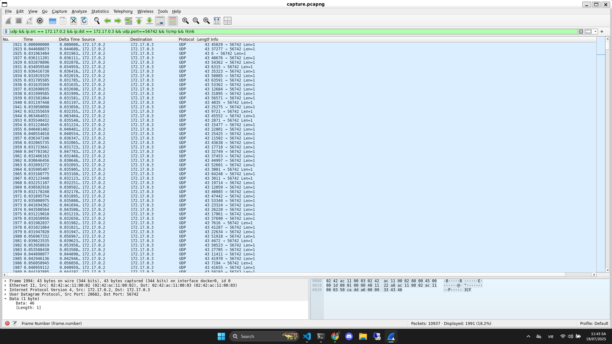

# Write Up

## Đọc file `send.py`

Mở file `send.py` lên đọc và phân tích

```bash
$ cat send.py
#!/usr/bin/env python3

import argparse
from progress.bar import IncrementalBar

from scapy.all import *
import ipaddress

import random
from time import time

def check_ip(ip):
  try:
    return ipaddress.ip_address(ip)
  except:
    raise argparse.ArgumentTypeError(f'{ip} is an invalid address')

def check_port(port):
  try:
    port = int(port)
    if port < 1 or port > 65535:
      raise ValueError
    return port
  except:
    raise argparse.ArgumentTypeError(f'{port} is an invalid port')

def main(args):
  with open(args.input, 'rb') as f:
    payload = bytearray(f.read())
  random.seed(int(time()))
  random.shuffle(payload)
  with IncrementalBar('Sending', max=len(payload)) as bar:
    for b in payload:
      send(
        IP(dst=str(args.destination)) /
        UDP(sport=random.randrange(65536), dport=args.port) /
        Raw(load=bytes([b^random.randrange(256)])),
      verbose=False)
      bar.next()

if __name__=='__main__':
  parser = argparse.ArgumentParser()
  parser.add_argument('destination', help='destination IP address', type=check_ip)
  parser.add_argument('port', help='destination port number', type=check_port)
  parser.add_argument('input', help='input file')
  main(parser.parse_args())
```

Lấy random theo thời gian: `random.seed(int(time()))`

Trộn byte theo random vừa lấy: `random.shuffle(payload)`

Gửi file theo giao thức UDP: `IP(dst=str(args.destination)) /
        UDP(sport=random.randrange(65536), dport=args.port) /
        Raw(load=bytes([b^random.randrange(256)])),`

---

## Dùng Wireshark bắt gói tin

Lọc ra những gói tin UDP với IP dest và Port dest cố định



Thấy trường `data` có duy nhất 1 giá trị -> Là giá trị được lấy ngẫu nhiên và gửi

Bây giờ chúng ta sẽ cần thu thập hết tất cả trường data theo filter này để giải mã

---

## Script

Tạo 1 script tự động hóa

```python
from scapy.all import *
import random

# 1. Đọc pcap
pkts = rdpcap('capture.pcapng')
# 2. Chọn các gói UDP với port đích là 56742 (đổi theo challenge)
pkts = [p for p in pkts if UDP in p and p[UDP].dport == 56742]

# 3. Lấy toàn bộ payload bytes (đã theo thứ tự gửi)
data = bytearray(b''.join(p[UDP][Raw].load for p in pkts))

# 4. Gán seed RNG với int(packets[0].time), theo write‑up
seed = int(pkts[0].time)
random.seed(seed)

# 5. Khôi phục thứ tự shuffle
order = list(range(len(data)))
random.shuffle(order)

# 6. Undo XOR: cần giữ đúng tiến trình RNG như khi gửi
#    và bỏ thêm một randrange(65536) mỗi byte như trong script gốc
for i in range(len(data)):
    random.randrange(65536)
    key = random.randrange(256)
    data[i] ^= key

# 7. Undo shuffle: đặt lại vào vị trí ban đầu
out = bytearray(len(data))
for i, pos in enumerate(order):
    out[pos] = data[i]

# 8. Ghi ra file
with open('recovered.png', 'wb') as f:
    f.write(out)

print(f"File đã tạo: recovered.png")
```

Chúng ta sẽ lấy thời gian gửi đi của gói đầu tiên làm thời gian sinh ra hàm random

Sau đó dịch ngược hết đống code python `send.py` là được

---

## Flag

Flag: picoCTF{n0_t1m3_t0_w4st3_5hufflin9_ar0und}